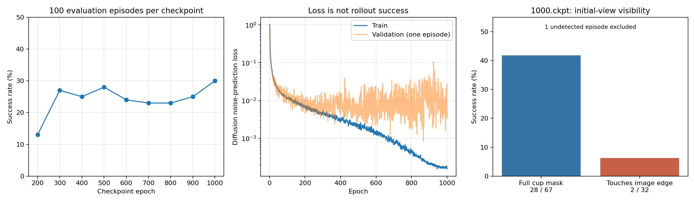
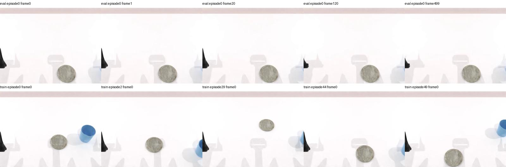

**place_empty_cup 成功率诊断 — 2026-09-24**

结论：本次 DP 低成功率不能直接归结为“模仿学习/VLA 的通病”。已经查到输入视野不足、推理历史帧重复以及验证集固定一条的具体问题。误差积累和恢复数据不足可能进一步放大失败，但尚未通过对照实验确定各因素的贡献。本次仅分析、统计和执行 CPU 接口检查，没有修改训练/评测代码，也没有重新训练或跑新的仿真对照实验。

**证据范围**

读取两段训练日志及 Hydra 配置、9 份完整结果与 900 个视频的帧数；对 1000.ckpt 的初始画面做杯子颜色分割；目视检查随机选取的 12 条失败轨迹与前 4 条成功轨迹的关键帧。失败样本编号为 10、11、20、39、53、58、67、79、88、93、94、97。另检查 episode0 及训练图像的边缘截断情况。关键帧抽查不是逐帧观看全部失败视频，不能据此给出所有失败阶段的精确占比。

**1. 实际训练与评测结果**

| checkpoint | 成功 / 100 |
|---|---:|
| 200 | 13 |
| 300 | 27 |
| 400 | 25 |
| 500 | 28 |
| 600 | 24 |
| 700 | 23 |
| 800 | 23 |
| 900 | 25 |
| 1000 | 30 |

训练从 500.ckpt 续训，最后日志为 epoch=999、global_step=64999，确实完成了 1000 轮。1000 轮末 train_loss=0.0001574、val_loss=0.0033698。300～1000 轮成功率没有随训练 loss 显著持续提升。不能据这些单次各 100 场的结果认定几个百分点的差异具有统计显著性，也不能单凭 train/val gap 断言过拟合是唯一原因。

**2. 最强的现场线索：唯一被模型使用的相机存在视野缺失**

训练 Zarr 实际只有 head_camera、state、action；head_camera 的形状为 (8620,3,240,320)。default_task_14.yaml 的 shape_meta 也只有 head_cam 和 agent_pos。采集虽开启腕部相机、深度和点云，当前 DP 未使用这些模态。额外传入推理字典并不意味着编码器会使用它们。

1000.ckpt 初始画面，利用蓝色杯子的 HSV 掩码自动分组：

| 初始画面组 | 成功 / 数量 |
|---|---:|
| 左侧、蓝色区域未接触左右边界 | 24 / 53 |
| 左侧、蓝色区域接触边界 | 0 / 6 |
| 右侧、蓝色区域未接触左右边界 | 4 / 14 |
| 右侧、蓝色区域接触边界 | 2 / 26 |
| 未检测到蓝色杯子 | 0 / 1 |

合计：触边 2/32（6.25%），未触边 28/67（41.79%）。算法只衡量蓝色区域是否触边，并不等同于完整物体可见性；触边组与右侧/空间位置高度相关，不能将差异全部归因于裁切。episode0 目视关键帧没有看到杯子，杯子缺乏可见信息的假设得到支持。训练首帧中右臂 28 条有 21 条蓝色区域触边，左臂 22 条有 1 条触边。这是现有观测设计本身的问题，并非简单的训练/测试图片通道错误。

优先验证：在头相机覆盖完整工作空间的设置下重新采集、转换、训练、评测；或把已有腕部 RGB 一起接入数据转换、dataset、shape_meta 和推理。不要只在评测时移动相机，否则引入新的视觉分布变化。增加图像像素数本身不能扩大视野。

**3. 已复现的实现问题：推理历史重复了最新观测**

调用链：deploy_policy.eval 每执行动作后 model.update_obs(obs)，DPRunner.get_action 在下一次推理时又 append 传入的同一状态。CPU 使用真实 DPRunner 和记录输入的假策略复现：第一轮 [0,0,0] 是正常初始化填充；执行 6 个动作后，下次推理输入 [5,6,6]，而连续三帧应为 [4,5,6]。

相关代码：policy/DP/deploy_policy.py:42、48；policy/DP/diffusion_policy/env_runner/dp_runner.py:78。这会造成训练/推理时序不一致，影响速度、进度和夹爪阶段判断。已经确认代码行为，尚未量化修复能提高多少成功率。应保证同一个仿真状态只入队一次，保留初始观测，并用相同场景与随机种子比较修复前后。

**4. 验证 loss 缺乏代表性，而且调整 val_ratio 目前无效**

common/sampler.py 中本应随机抽取 val_idxs 的代码被注释，实际硬编码 val_idxs=-1。CPU 检查发现 val_ratio=0.02 和 0.2 都只选 episode49。实际训练 49 条（左22、右27），验证仅右臂1条。应恢复按 episode 划分，并在左右侧/空间位置上检查覆盖。不能仅修改 val_ratio 就期待有10条验证数据。

train/val loss 是 diffusion 噪声预测损失，不是杯子位姿误差，也不是成功率；而训练验证用 self.model，部署配置 use_ema=true 时使用 EMA 模型，指标对应的权重也不同。建议同时记录代表性验证集损失和独立闭环 rollout 成功率。

**5. 视频观察与任务判定**

- episode10、53、93：关键帧显示杯子没有被搬运，夹爪却继续向杯垫附近移动，符合抓取失败后缺乏纠错的行为。
- episode20：关键帧几乎没有有效推进，杯子在画面右边缘。
- episode67、79、94、97：杯子被搬运到杯垫附近，但后期仍有偏移或未完成最终释放；仅凭 RGB 不能区分位置、高度和夹爪哪个条件失败。
- episode1、3、5、8 是成功对照。

失败抽样见 rollouts_0.jpg～rollouts_2.jpg，成功对照见 rollouts_3.jpg。

任务 check_success 要求功能点水平距离 <3.5 cm、垂直距离 <1.5 cm，且两个夹爪都张开。因此“看着差不多放到了”不等于成功。1000.ckpt 的70个失败视频均为500帧，与任务500动作步上限对应；成功视频提前结束。按视频长度推断逐 episode 成败，与每个结果文件的汇总一致，但没有原始逐场成功标记与物体位姿日志，属于间接标签。

建议评测记录 cup/coaster 功能点、dx/dy/dz、左右夹爪开度、是否抓起、是否掉落、首次失败阶段、场景seed和checkpoint。不要放宽成功条件来代替提升策略。

**6. 数据与控制层面的候选原因**

50 条示范共有 8620 个训练转移，其中左22、右28，没有严重左右数量失衡。相邻帧高度相关，不能把8620帧当8620个独立场景。当前位置覆盖、抓取接触和恢复行为可能不足；这属于待对照验证的解释，不能仅从条数断定“50条一定不够”。视觉 ResNet18 weights=null，当前没有使用预训练视觉权重。

策略每次预测后执行6个动作，再次推理。执行中虽采集新观测，但不会重算尚未执行的动作。可在修复重复观测后，比较执行1/3/6步；保持模型训练时的 n_obs_steps=3，不能为方便随意改变。短动作段并不保证更好，需要消融验证。当前仿真是同步执行，100次扩散去噪首先影响墙钟耗时，不能直接说 GPU 推理慢就造成物理滞后。

专家采集与推理底层轨迹执行方式也应在需要时比较：采集按 save_freq=15 保存状态，评测用 TOPP 对目标关节位置重新定时。现阶段没有测得它对失败的贡献，不把它列为已证实根因。

**7. 已排除或没有证据支持的说法**

- 本轮确实训练到了1000轮，模型文件存在；不能继续归因为600轮提前结束。
- 全部 Zarr state/action 均有限；每条轨迹的 action[t] 与 state[t+1] 对齐，未见这类错位。
- 抽查 episode0 原始 HDF5 解码图像与 Zarr 完全相同，关节状态一致。
- 不能因为 cv2.imdecode 默认 BGR 就断定训练/推理 RGB 对调：当前保存端直接对 RGB 数组 cv2.imencode，再由 cv2.imdecode 回读，两次约定抵消；不要只在读取端额外加一次通道交换。
- instruction_type=unseen 是语言模板选项；本 DP 读取 instruction 后未将其输入模型，不能把失败解释成“理解不了 unseen 指令”。
- eval_video_log 和额外 depth/pointcloud 采集影响资源开销，不代表模型获得了深度/三维信息。

**8. 是否是模仿学习和 VLA 的通病？**

模仿学习是训练方式，VLA 是模型类别，两者不是互斥类别；许多 VLA 也用示范进行动作监督。你当前训练的是视觉 DP，而非 VLA。它们可能共享：训练于成功示范，部署时小误差产生未见状态；缺少纠错示范；接触和精确放置对误差敏感。但这些不等于所有方法必然低成功率，也不能替当前可修复的问题开脱。

DAgger 论文说明策略自己的动作改变后续观测分布，是普通监督学习假设失效的来源：[Ross et al., 2011](https://proceedings.mlr.press/v15/ross11a.html)。DP 原论文明确讨论示范不足与动作执行跨度的权衡：[Diffusion Policy, limitations](https://diffusion-policy.cs.columbia.edu/diffusion_policy_ijrr.pdf)。OpenVLA 2024 的比较中，DP 在部分范围较窄但要求精细操作的任务上轨迹更平滑精确；这不代表所有后续 VLA，也说明换成语言模型不保证解决本任务：[OpenVLA §5.2/§6](https://arxiv.org/html/2406.09246v3)。

**9. 建议的最小对照顺序**

1. 保存当前1000.ckpt和30%基线；补齐逐场seed、模型、成功阶段和误差记录，避免评测结果无法关联。
2. 只修复历史帧重复，保持checkpoint和相机不变，先做固定场景的小规模对照，再用相同100场和多个采样种子确认。
3. 修复验证划分，建立代表性的独立验证场景。不要用最终测试集反复调参再宣称无偏测试性能。
4. 保持工作空间不变，改善相机覆盖并重采重训，或接入已有腕相机后重训。先证明观察到了杯子，再增加模型规模。
5. 基于失败位置/阶段补示范（可比较50/100/200条作为实验规模，不承诺阈值）；对抓空、偏移、掉落补专家纠错，保留失败状态加正确恢复动作，而不是把失败动作直接当专家标签。
6. 在上述问题处理后，比较动作执行跨度与DP/VLA，统一机器人、输入模态、数据量、测试场景和成功条件；跨方法差异才有解释意义。

本报告中“已证实”指代码行为或已有数据统计；“导致成功率下降多少”仍需干预对照。边缘统计与视频抽样支持优先排查视觉覆盖和闭环纠错，但不提供单一根因的因果证明。
